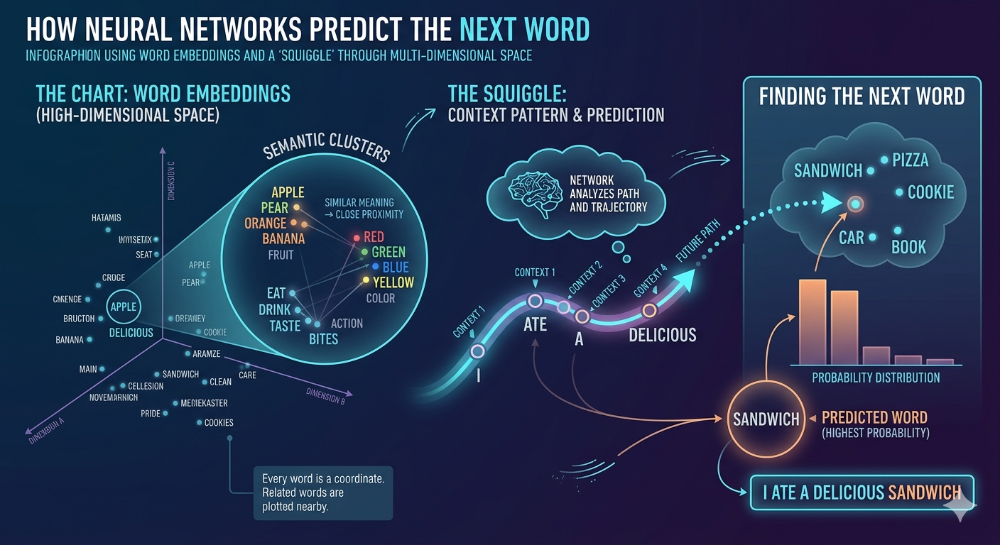

+++
title = 'Neural Network Word Prediction: Vector Embeddings and Manifold Theory'
date = 2026-03-10T21:32:19.596325
draft = false
tags = ['llm', 'machine-learning', 'ai']
description = 'No description.'
+++

### Overview
Neural networks predict the next word by mapping words to coordinates within a high-dimensional space and then modeling the contextual trajectory to identify the most probable successor. This process leverages **Vector Embeddings** and principles of **Manifold Theory**.

### Key Insights
*   Words are represented as **multi-dimensional vectors**, not symbolic strings.
*   **Semantic similarity** directly correlates with spatial proximity in the embedding space.
*   Neural networks learn a **mathematical function** that captures the contextual relationships and "momentum" within a word sequence.
*   Prediction involves extrapolating this function's trajectory to pinpoint the next likely word's coordinates.
*   Modern Large Language Models operate in **thousands of dimensions**, making direct human visualization challenging.

### Technical Details

#### The Embedding Space: A Multi-Dimensional Chart
Neural networks transform discrete words into continuous numerical representations called **Vector Embeddings**. Each word corresponds to a point, or coordinate, in a vast, multi-dimensional space.

*   **Semantic Encoding:** Words with similar meanings (e.g., "apple" and "pear") are embedded close together in this space. Conversely, semantically unrelated words (e.g., "apple" and "extinguisher") reside far apart.
*   **High Dimensionality:** Unlike a simple 2D or 3D chart, these embedding spaces typically comprise hundreds to thousands of dimensions. This high dimensionality allows the model to capture complex nuances of meaning and relationships that are imperceptible in lower dimensions.

#### Identifying Contextual Patterns: The "Squiggle" Analogy
When processing a sequence of words, a neural network interprets them as a series of points in the embedding space. It then identifies a **mathematical function** or trajectory that represents the contextual "path" established by these words. While often simplified as a "squiggle," this function is a sophisticated model of linguistic relationships.

*   **Relationship to Manifold Theory:** The sequence of words implicitly defines a path on a lower-dimensional **manifold** embedded within the higher-dimensional space. The network learns to approximate this manifold, understanding the direction and "momentum" of the conversation.
*   **Beyond Simple Connection:** This function does not merely connect existing word points; it encapsulates the semantic, syntactic, and pragmatic relationships, enabling the model to infer the logical progression of thought or language.

#### Predicting the Next Word
The core of next-word prediction lies in extending the learned contextual trajectory into the unseen future of the embedding space.

1.  **Trajectory Determination:** Given an input sequence, the network identifies the current path or "squiggle" within the embedding space.
2.  **Extrapolation:** The model projects this trajectory forward, calculating the most probable region or point where the next word should logically reside.
3.  **Candidate Selection:** The network then searches the entire vocabulary for the word whose embedding vector is closest to this predicted future point. This word is then chosen as the most likely next word.
    For example, if the trajectory moves through the "food" area of the embedding space after "I ate a," the projected point will be closer to the coordinates of "bagel" or "cereal" than to "motorcycle."

